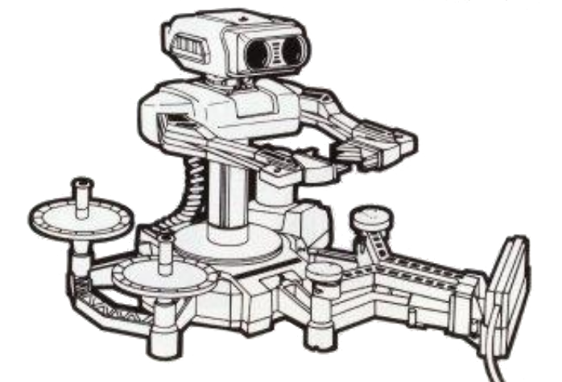
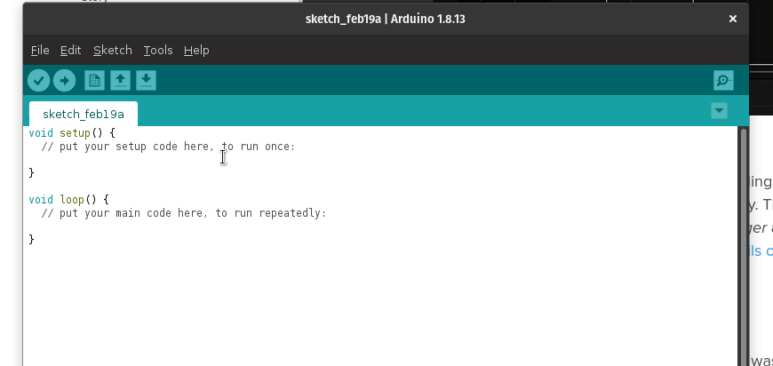

NES R.O.B. Control Library
==========================

This library allows an Arduino board to control the Nintendo Robotic Operating
Buddy (R.O.B.). The standard hardware configuration needed to control R.O.B.
requires the placement of an LED in front of the left eye. This library can
be used to generate pulses with the LED, resulting in full control of R.O.B.



The `NesRob` library simplies the interaction with the NES R.O.B., by handling
the precision timing and command processing necessary to control R.O.B. The end
user can simply choose an LED pin, then supply any of R.O.B.'s available actions
to invoke the specified behavior in R.O.B. This library operates on top of the
Arduino API, and therefore should be available to any Arduino compatible device.

Usage
-----

You may simply download and install this library using the **Arduino Library
Manager**:



The source code is relatively straight-forward. Here is an example that will
blink R.O.B.'s LED:

```c++
#include "NesRob.h"

NesRob rob(LED_BUILTIN);

void setup() {
  // put your setup code here, to run once:

}

void loop() {
  rob.sendCommand(NesRob::Command::LED_ENABLE);
  ::delay(1000);  // wait for a second
  rob.sendCommand(NesRob::Command::LED_DISABLE);
  ::delay(1000);  // wait for a second
}
```

> _**NOTE:** This example is offered by the library as `Blink`._

### Examples

* [Blink](https://www.github.com/zfields/nes-rob/tree/main/examples/Blink/Blink.ino):
Validate your hardware configuration by flashing the LED on R.O.B.'s head.

* [Stow](https://www.github.com/zfields/nes-rob/tree/main/examples/Stow/Stow.ino):
Put R.O.B. into the position required to fit in the original packaging.

* [StowPseudoInterrupt](https://www.github.com/zfields/nes-rob/tree/main/examples/StowPseudoInterrupt/StowPseudoInterrupt.ino):
Use the LED as a pseudo-interrupt to put R.O.B. into the position required to
fit in the original packaging.

* [TestMotorArms](https://www.github.com/zfields/nes-rob/tree/main/examples/TestMotorArms/TestMotorArms.ino):
Test the left shoulder motor, which will cause R.O.B.'s arms to close and open.

* [TestMotorShoulders](https://www.github.com/zfields/nes-rob/tree/main/examples/TestMotorShoulders/TestMotorShoulders.ino):
Test the right shoulder motor, which will cause R.O.B.'s shoulders to move down
and up.

* [TestMotorTorso](https://www.github.com/zfields/nes-rob/tree/main/examples/TestMotorTorso/TestMotorTorso.ino):
Test the base motor, which will cause R.O.B.'s torso to twist left and right.

API Documentation
-----------------

The API documentation is generated using
[Doxygen](https://www.doxygen.nl/index.html) and is hosted with GitHub pages.

[Click here](https://zfields.github.io/nes-rob/classNesRob.html) to view the
API documentation page.

Research
--------

The research for this project describes the protocol, as well as provides
oscilloscope readings to describe the signal behavior captured in the library.

[Click here](https://github.com/zfields/nes-rob/tree/main/docs/research.md)
to view the research page.

BluesRob Project
----------------

A project enabling R.O.B. to receive and respond to commands over the global
cellular network!

[Click here](https://www.hackster.io/zachary_fields/cellular-r-o-b-with-blues-wireless-38ac41)
to view the project page.

[Click here](https://github.com/zfields/BluesRob/blob/main/BluesRob.ino) for the
application source code, and an example of usage with native interrupts.

Running Tests
-------------

The tests are designed to be executed using Docker, and the environment required
by the tests is defined in `test/Dockerfile`. The following directions are
provided to aid in executing the tests in a container.

1. From the `nes-rob` folder, build the container with the following command:

```none
docker build test --tag nes-rob-test
```

2. Execute the tests inside the container using the following command:

```none
docker run --rm --volume $(pwd):/nes-rob/ nes-rob-test
```

3. Similar test results should print to your terminal for review.

```none
==29== Memcheck, a memory error detector
==29== Copyright (C) 2002-2017, and GNU GPL'd, by Julian Seward et al.
==29== Using Valgrind-3.16.1 and LibVEX; rerun with -h for copyright info
==29== Command: ./nes_rob_tests
==29==
===============================================================================
All tests passed (98 assertions in 88 test cases)

==29==
==29== HEAP SUMMARY:
==29==     in use at exit: 72,704 bytes in 1 blocks
==29==   total heap usage: 18,118 allocs, 18,117 frees, 1,166,036 bytes allocated
==29==
==29== LEAK SUMMARY:
==29==    definitely lost: 0 bytes in 0 blocks
==29==    indirectly lost: 0 bytes in 0 blocks
==29==      possibly lost: 0 bytes in 0 blocks
==29==    still reachable: 72,704 bytes in 1 blocks
==29==         suppressed: 0 bytes in 0 blocks
==29== Rerun with --leak-check=full to see details of leaked memory
==29==
==29== For lists of detected and suppressed errors, rerun with: -s
==29== ERROR SUMMARY: 0 errors from 0 contexts (suppressed: 0 from 0)
------------------------------------------------------------------------------
                           GCC Code Coverage Report
Directory: ../src
------------------------------------------------------------------------------
File                                       Lines    Exec  Cover   Missing
------------------------------------------------------------------------------
signal_generator.cpp                          36      36   100%
pulse_driver.hpp                               1       1   100%
led_ntsc_driver.cpp                           34      34   100%
w_wave_driver.cpp                             44      44   100%
------------------------------------------------------------------------------
TOTAL                                        115     115   100%
------------------------------------------------------------------------------
lines: 100.0% (115 out of 115)
branches: 100.0% (134 out of 134)
```

> _**NOTE:** If you are uncomfortable using Docker, then you may wish to use the
> Dockerfile as a guide and install the necessary dependencies and execute
> `./run_all_tests.sh` locally._

Credits
-------

This library builds the research done by `x87bliss` along with those on the
[Atari Age Forums](https://atariage.com/forums/topic/177286-any-interest-in-nes-rob-homebrews/),
as well as
[Anne Barela's guide](https://learn.adafruit.com/controlling-a-classic-nintendo-r-o-b-robot-using-circuit-playground-express/overview)
at Adafruit.
