R.O.B. Reverse Engineered
=========================

Reverse Engineering the Nintendo Robot Operating Buddy (#NES-012).

As you may have observed, it is not possible to use the R.O.B. with a Nintendo
Entertainment System connected to a liquid crystal diode (LCD) television. The
reason being, the detection chip in its head requires the specific flash timing
of [NTSC](https://en.wikipedia.org/wiki/NTSC) signals; generated by a cathode
ray tube (CRT) television.

The document is intended to serve as research documenting both the internal and
external inputs used to control R.O.B.

Light Signals
-------------

R.O.B. has a light sensor in the left eye. When R.O.B.'s head is directed toward
a R.O.B. compatible game, either
[Gyromite](https://en.wikipedia.org/wiki/R.O.B.#Gyromite) or
[Stack-up](https://en.wikipedia.org/wiki/R.O.B.#Stack-Up), the game will emit
light signals instructing R.O.B. how to play along. The light signals are NTSC
encoded, black and green flashes. In the [command sequence](#command-sequence),
black flashes are represented as `0`'s, and green flashes are represented as
`1`'s.

Fortunately, these signals can be reproduced using any color LED and adhering to
the timing required to emulate NTSC signals. When using an LED, `0` (or black)
can be recreated by simply leaving the LED off, while `1` (or green) can be
recreated by turning the LED on.

### Command Sequence

A command sequence is comprised of a 13-bit pattern with a 5-bit preamble of
`00010`, followed by a unique 8-bit [command byte](#command-bytes).

#### Preamble

The preamble begins with three off bits. This is important during gameplay where
light is ever present and generating signal noise. The leading off bits seem
less important when generating the signal using an LED, because the LED is
assumed to be off prior to emitting the signal. In either case, the first three
bits of the preamble ensure enough space has passed between successive commands,
which allows the command pattern to be distinguished from noise on the signal
line from light or partial commands.

> _**NOTE:** A
> [post in the Atari Age Forums](https://atariage.com/forums/topic/177286-any-interest-in-nes-rob-homebrews/?tab=comments#comment-2258585)
> explains, the 13-bit pattern takes 14 cycles to execute in order to achieve
> proper timing._

#### Command Bytes

- [`0xAB`] CALIBRATE_MOTORS
- [`0xEB`] TEST_LED
- [`0xBA`] ARMS_LEFT
- [`0xEA`] ARMS_RIGHT
- [`0xAE`] ARMS_LOWER
- [`0xFB`] ARMS_LOWER_2
- [`0xFA`] ARMS_RAISE
- [`0xBB`] ARMS_RAISE_2
- [`0xBE`] ARMS_CLOSE
- [`0xEE`] ARMS_OPEN

### Test Signal

In a
[video of the Gyromite TEST mode](https://www.youtube.com/watch?v=fThtTzKbqyY),
the LED on R.O.B.'s head can be observed blinking on and off without engaging
the motors. This led to the discovery of an additional input sequence. The test
screen flashes a continuous, alternating binary stream (e.g. `101010101010...`).

At the time of writing, the test signal is the only way known to disable the
LED. However, the behavior resulting from this signal is more complicated than
simply disabling the LED.

**Observed Behavior:**

- `10` issued 10 times (or `10101010101010101010`) was discovered to be the most
reliable way to elicit a response from R.O.B. _(responses have been observed
with less iterations, but the response is sporadic at best)_.
- If the LED starts `OFF`, it will flash `ON` for ~264ms, and turn `OFF` again.
- If the LED starts `ON`, it will turn `OFF` immediately.
- If the signal is accepted, the LED will always end in the `OFF` position;
regardless of the starting position.
- When the signal is issued constantly the light will blink at a regular
interval, as seen in the Gyromite test screen video.

**Signal Response:**

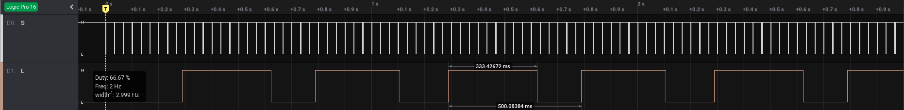
_Test signal issued continuously._

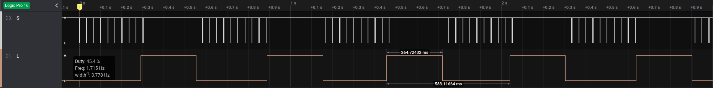
_Test signal issued intermittently._

_Alternating `TEST_LED` and test signal issued continuously._

_Alternating `TEST_LED` and test signal issued intermittently._

> _**NOTE:** For completeness, the command sequence `0xAA` was tested, due to
it's similarity to the test signal, but it was discovered to have no effect._

Wired Signals
-------------

The R.O.B. has a chip in its head used to transform incoming light signals. As
each light pulse is successfully recognized, a distinct,
[marker signal](#marker-signal) is sent across the ribbon cable from the MCU in
R.O.B.'s  head to the logic chip in the base.

### Ribbon Cable

The ribbon cable running between R.O.B.'s head and base has four wires. The pins
on the plug-in at the base are labelled `G`, `S`, `V`, `L` (from left to right).

After watching the signals travel across the wire, the pins are assumed to be
the following:

- [`G`] Ground (`Vdd`)

  Common reference to ground.

- [`S`] Signal

  The PCB in R.O.B.'s base pulls this line up to `Vcc`, then head will pull the
  line to ground to generate a digital signal. The signal appears to be the
  encoded form of the original [command sequence](#command-sequence) supplied to
  R.O.B.

  The signal line becomes very active once a command is successfully parsed and
  the motors are engaged. The activity presents itself as chaotic, digital
  waveforms generated by the head. There is no obvious pattern in the activity,
  and the signal does not appear to affect the execution of the initial command.
  Therefore, the activity observed during motor operation is considered to be
  noise.

- [`V`] Power (`Vcc`)

  ~6VDC supplied directly from the 4 (AA) batteries.

- [`L`] LED

  The LED operates at ~2VDC, and is controlled by the MCU in R.O.B.'s base. The
  light is off when R.O.B. first powers on, and turns on immediately after
  R.O.B. finishes processing its first instruction. During normal operation, the
  LED is lit until R.O.B. receives a command. When a command is accepted, the
  light will turn off as the motors engage, and remain off for the duration of
  the command execution. Once the motors have stopped, the LED will turn on,
  indicating R.O.B. is ready to process the next instruction.

### Protocol

The transmission on the signal (`S`) line from the head to the base is divided
into two distinct parts. First, the command sequence, which uses the
[marker signals](#marker-signals) to generate a clean signal. Then, while the
motors are engaged (as observed by voltage dips/spikes on the `V` pin),
seemingly random noise that appears to reflect external influences from the
environment.

Only the first part is required to manipulate R.O.B., so we shall focus our
effort on deciphering that portion of the transmission.

**Observations:**

- On first signal, the signal line appears to be pulled low at ~156ms
(a.k.a. immediately following motor engagement).
- Before LED is enabled, the signal line is pulled low, LED is enabled, and the
signal is released after 600-800us.

#### Marker Signal

  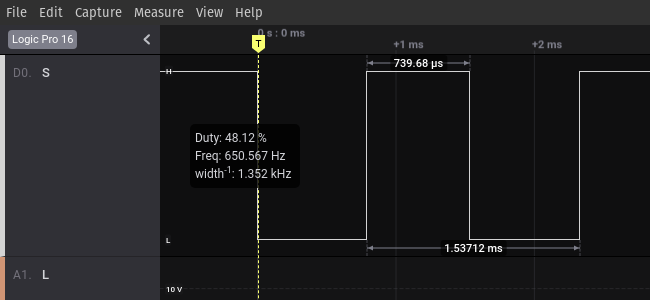

  The marker signal spans approximately 2.33ms.

#### Command Timing

- CALIBRATE_MOTORS

  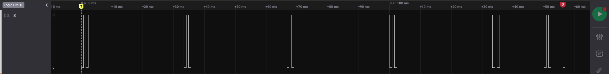

- TEST_LED

  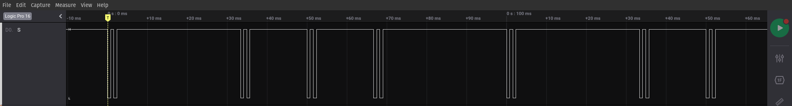

- ARMS_LEFT

  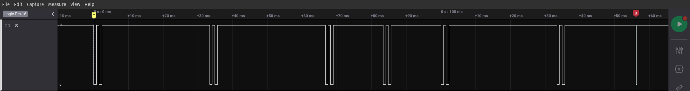

- ARMS_RIGHT

  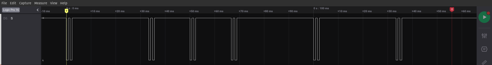

- ARMS_LOWER

  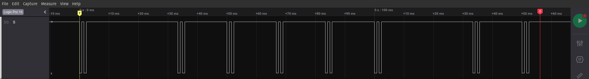

- ARMS_LOWER_2

  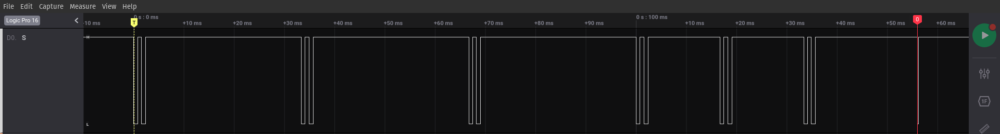

- ARMS_RAISE

  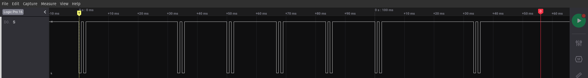

- ARMS_RAISE_2

  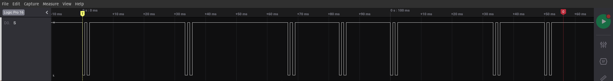

- ARMS_CLOSE

  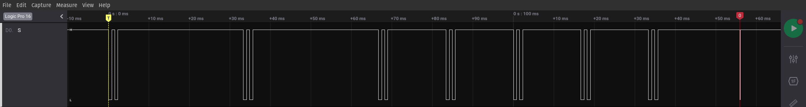

- ARMS_OPEN

  

Physical Characteristics
------------------------

| Dimensions        | Value | Unit |
|------------------:|:-----:|:----:|
| Height            |   9.5 |  in  |
| Width (Base)      |   6   |  in  |
| Weight            |   1.46| lbs  |

| Range of Motion   | Value | Unit |
|------------------:|:-----:|:----:|
| Arms Left/Right   | 300   | deg  |
| Arms Up/Down      |   2.75|  in  |
| Arms Open/Close   |   2.75|  in  |
| Head Tilt Up/Down |  45   | deg  |

Power Characteristics
---------------------

|                     | Value | Unit |
|--------------------:|:-----:|:----:|
| Operating Voltage   |   6   |   V  |
| Idle Current        |  19   |  mA  |
| Start-Up Current    | 700   |  mA  |
| Logic Level Voltage |   6   |   V  |
| LED Voltage         |   1.9 |   V  |

Additional Resources
--------------------

- [Adafruit: Controlling a Classic Nintendo R.O.B. Robot Using Circuit Playground Express](https://learn.adafruit.com/controlling-a-classic-nintendo-r-o-b-robot-using-circuit-playground-express/overview)
- [Atari Age Forum: Any interest in NES ROB homebrews?](https://atariage.com/forums/topic/177286-any-interest-in-nes-rob-homebrews/)
- [GitHub: NES R.O.B. Control Library](https://github.com/zfields/nes-rob)
- [Nintendo Manual: Gyromite (1985)](img/nintendo-manual-gyromite-1985.pdf)
- [Nintendo Manual: Stack-Up (1985)](img/nintendo-manual-stack-up-1985.pdf)
- [Robots and Computers: #NES-012 by Nintendo](http://www.robotsandcomputers.com/robots/nrob.htm)
- [Tindie: Bluetooth Control Goggles for R.O.B. Nintendo](https://www.tindie.com/products/cxelectronics/bluetooth-control-goggles-for-rob-nintendo/)
- [Wikipedia: R.O.B.](https://en.wikipedia.org/wiki/R.O.B.)
