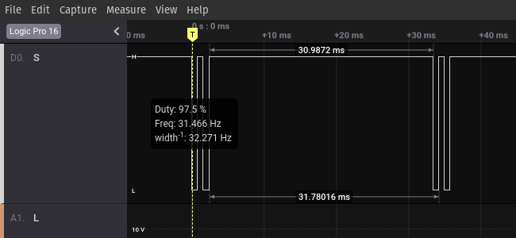
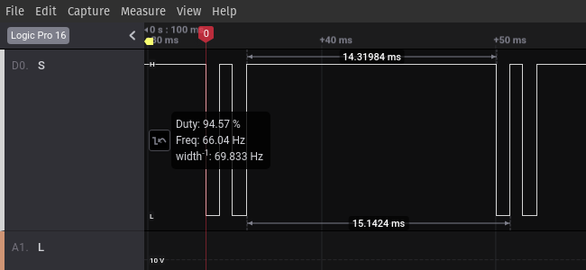
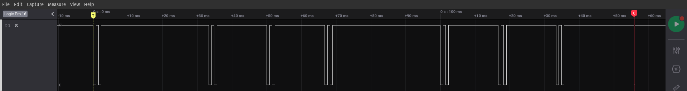

R.O.B. Reverse Engineered
=========================

Reverse Engineering the Robot Operating Buddy, by Nintendo.

As you may have guessed, it is not possible to use the R.O.B. with a Nintendo
Entertainment System connected to a liquid crystal diode (LCD) television. The
reason being, the detection chip in its head requires the specific flash timing
of [NTSC](https://en.wikipedia.org/wiki/NTSC) signals; generated by a cathode
ray tube (CRT) television.

Light Signals
-------------

R.O.B. has a light sensor in the left eye. When R.O.B.'s head is directed toward
a R.O.B. compatible game, either [Gyromite](https://en.wikipedia.org/wiki/R.O.B.#Gyromite)
or [Stack-up](https://en.wikipedia.org/wiki/R.O.B.#Stack-Up), the game will emit
light signals instructing R.O.B. how to play along. The light signals are
comprised of a 13-bit pattern with a 5-bit preamble of `00010`, followed by a
[unique 8-bit command sequence](#light-commands). On screen, `0`'s are
represented as black flashes, and `1`'s are represented as green flashes.

Fortunately, these signals can be reproduced using any color LED and adhering to
the timing required to emulate NTSC signals. When using an LED, `0` (or black)
can be recreated by simply leaving the LED off, while `1` (or green) can be
recreated by turning the LED on.

> _**NOTE:** When using an LED to generate the signals, you must respect the
> inherenit difference in assumptions than those used when decoding the NTSC
> signals during gameplay. The most obvious difference is the assumed starting
> position. During gameplay, we can assume light is present, because the game
> is being played. However, with a generated LED signal, we would assume the
> opposite, or that the LED is off, prior to emitting the signal._

### Light Preamble

When using an LED, the first three bits of the preamble do nothing, other than
to ensure enough space has passed between commands to allow the command pattern
to be distinguised from the noise on the signal line from light or partial
commands.

> _**NOTE:** A [post in the Atari Age Forums](https://atariage.com/forums/topic/177286-any-interest-in-nes-rob-homebrews/?tab=comments#comment-2258585),
> mentions the 13-bit pattern takes 14 cycles to execute._

> _**HYPOTHESIS:** The first three zeros represent no light (i.e. no active
> input) for three timing periods. As such, the insignifcant digits, or leading
> zeros, can be eliminated and only `10` is required as a command preamble._

> _**OBSERVATION:** Eliminating the leading zeros does not affect an individual
> command._

> _**HYPOTHESIS:** The first three zeros represent no light (i.e. no active
> input) for three timing periods. As such, this period can serve no purpose
> other than to act as a buffer between input commands. Therefore, a `1`
> directly proceeding the preamble will not affect the command._

> _**OBSERVATION:** Prefixing a `1` to the standard preamble does not affect the
> command._

### Light Commands

- [`0xAB`] CALIBRATE_MOTORS
- [`0xEB`] TEST_LED
- [`0xBA`] ARMS_LEFT
- [`0xEA`] ARMS_RIGHT
- [`0xAE`] ARMS_LOWER
- [`0xFB`] ARMS_LOWER_2
- [`0xFA`] ARMS_RAISE
- [`0xBB`] ARMS_RAISE_2
- [`0xBE`] HANDS_CLOSE
- [`0xEE`] HANDS_OPEN

Wired Signals
-------------

The R.O.B. has a chip in its head used to filter incoming light signals. As each
light pulse is successfully recognized, a distinct signal is sent across the
ribbon cable from the MCU in the head to the motor driving MCU in R.O.B.'s base.

### Ribbon Cable

The ribbon cable running between R.O.B.'s head and base has four wires. The pins
on the plug-in at the base are labelled `G`, `S`, `V`, `L` (from left to right).

After watching the signals travel across the wire, the pins are assumed to be
the following:

- [`G`] Ground (`Vdd`)

  Common reference to ground.

- [`S`] Signal

  The PCB in R.O.B.'s base pulls this line up to `Vcc`, then head will pull the
  line to ground to generate a digital signal. The signal appears to follow a
  [proprietary protocol](#protocol) (described below).

  - Signal is always digital, even when latch is low, however there is no clear
  pattern in the signal line when latch is low.
  - On first signal, when latch is low, the signal line appears to be pulled low
  at ~156ms (typical latching time).

- [`V`] Power (`Vcc`)

  Constant 6VDC

- [`L`] Latch

  The line stays at ~2VDC while waiting for a command. The pin is pulled to
  `Vdd` ~156ms from the time the first edge _(falling)_ is observed on the `S`
  pin. `L` will remain at `Vdd` while the motors are engaged, until R.O.B. is
  ready to process the next command.

  - Latch is held high by the base.
  - Latch is at `Vdd` until the first command is received.
  - Before latch is released, the signal line is pulled low, latch is released,
  and then signal is release after 600-800us.

  > _**NOTE:** At this time, it is unclear whether the line is held high by the
  > MCU in R.O.B.'s head or base. Intuitively, it seems as if the line must be
  > held at 2VDC by the head. This would allow the base to indicate to the head
  > whether it is actively executing the last instruction or ready to process
  > the next instruction. Furthermore, it is operating at a different voltage
  > than the `S` pin, which is known to be held high by the base. The difference
  > in voltage may be a reflection of the operating voltage of the MCU in the
  > head._

### Protocol

The transaction from the head to the base is divided into two distinct parts,
which can be easily distinguished by watching the voltage on the `L` line move
from 2VDC to ground and back. The `L` pin, appears to be a digital signal latch.
The protocol bits appear to be represented by constant time intervals, which are
sperated by a distinct marker signal.

#### Timing Components

- Marker Signal (~2.33ms)

  

- Long Period (~31ms)

  

- Short Period (~14.33ms)

  

#### Command Timing

- CALIBRATE_MOTORS

  

- TEST_LED

  

- ARMS_LEFT

  

- ARMS_RIGHT

  

- ARMS_LOWER

  

- ARMS_LOWER_2

  

- ARMS_RAISE

  

- ARMS_RAISE_2

  

- HANDS_CLOSE

  

- HANDS_OPEN

  

#### Interpretations

When looking at the protocol signals generated from interpreted light signals
viewed by R.O.B., two clear patterns emerge. The protocol either has long and
short bits, or can be broken into empty or split time periods. Either
interpretation will create unique input, but it can be difficult, or even
impossible, to make inferences regarding the protocol without, first, fully
understanding the protocol.

##### Long/Short Bits

When viewing a signal in isolation, the two distinct time periods can be mapped
directly to on/off bits, and are reminiscent of the
[1-Wire Protocol](https://en.wikipedia.org/wiki/1-Wire). For the sake of this
exercise, we will adopt the 1-Wire convention and consider long periods as `0`
and the short periods as `1`.

- [`00001`] CALIBRATE_MOTORS
- [`011001`] TEST_LED
- [`00110`] ARMS_LEFT
- [`01100`] ARMS_RIGHT
- [`0111101`] ARMS_LOWER
- [`00011`] ARMS_LOWER_2
- [`011110`] ARMS_RAISE
- [`001101`] ARMS_RAISE_2
- [`001111`] HANDS_CLOSE
- [`011011`] HANDS_OPEN

The most troubling concern with this interpretation is the inconsistency in
length. As you can see, `ARMS_LOWER_2` has a length of seven, while other
commands, such as `ARMS_LEFT`, have a length of five. This observation makes it
an unlikely candidate for decoding the protocol.

##### Empty/Split Fixed Time Periods

This interpretation is not as obvious when looking at any given signal trace,
but the pattern begins to emerge when the traces are viewed together
[as seen above](#command-timing). First, we observe the latch line is pulled low
at ~156ms for all commands, and all commands have markers at time 0ms, 33.33ms,
66.66ms, 99.99ms, 132.32ms. This observation is supported by the fact two
short periods, separated by a marker signal, are equal in length to a long
period.

For the sake of this exercise, we will consider split periods as `1` and the
empty periods as `0`.

- [`00001`] CALIBRATE_MOTORS
- [`01001`] TEST_LED
- [`00100`] ARMS_LEFT
- [`01000`] ARMS_RIGHT
- [`01101`] ARMS_LOWER
- [`00010`] ARMS_LOWER_2
- [`01100`] ARMS_RAISE
- [`00101`] ARMS_RAISE_2
- [`00110`] HANDS_CLOSE
- [`01010`] HANDS_OPEN

> _**NOTE:** In either interpretation, the binary assignment is irrelevant, and
> could be just as easily represented in the opposite fashion._

Power Characteristics
---------------------

|                   | Value | Unit |
|------------------:|:-----:|:----:|
| Operating Voltage |     6 |   V  |
| Idle Current      |    19 |  mA  |
| Start-Up Current  |   700 |  mA  |

Additional Resources
--------------------

- [Adafruit: Controlling a Classic Nintendo R.O.B. Robot Using Circuit Playground Express](https://learn.adafruit.com/controlling-a-classic-nintendo-r-o-b-robot-using-circuit-playground-express/overview)
- [Atari Age Forum: Any interest in NES ROB homebrews?](https://atariage.com/forums/topic/177286-any-interest-in-nes-rob-homebrews/)
- [GitHub: NES R.O.B. Control Library](https://github.com/zfields/nes-rob)
- [Tindie: Bluetooth Control Goggles for R.O.B. Nintendo](https://www.tindie.com/products/cxelectronics/bluetooth-control-goggles-for-rob-nintendo/)
- [Wikipedia: R.O.B.](https://en.wikipedia.org/wiki/R.O.B.)
